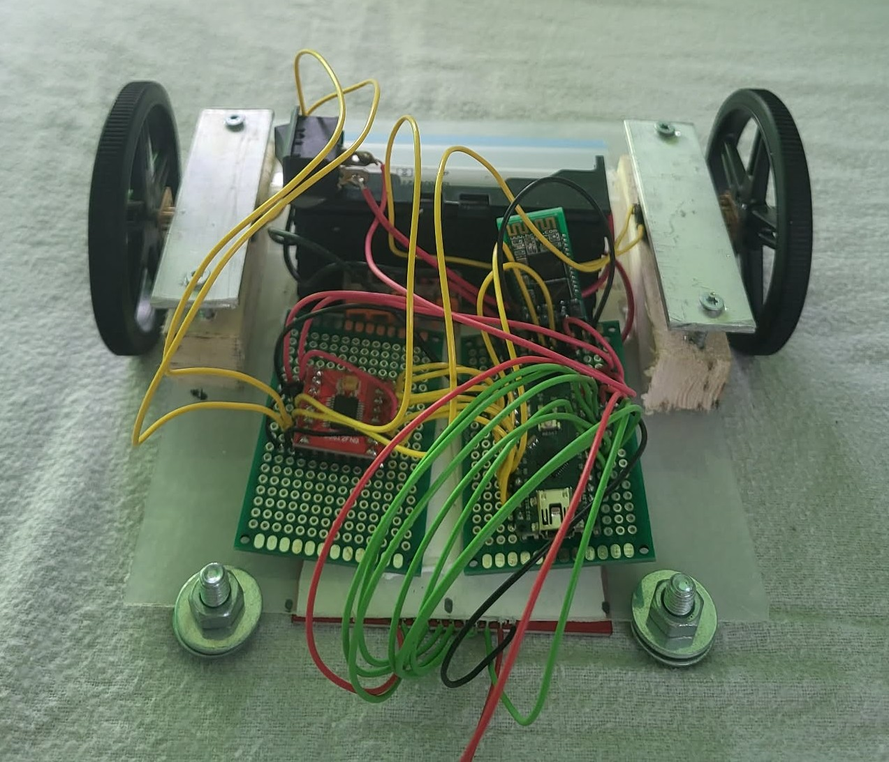

# LineFollower

  
## specifications

microcontroller: ATmega328 (Arduino Nano)

motors: JGA12-N20-30 

h-bridge:TB6612FNG Motordriver

sensors: QTR-8A/8x-ir-lijn-tracking-module

batteries: lithium ions 

wireless communication: HC-05

distance sensor - motors: 7cm  

weight: /

speed: 0.45 m/s

